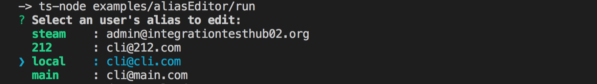

# Alias Editor

Prompts the user to select a username (with or without an alias) to add, edit, or remove the current alias.



To run from cloned repo without compiling:

```
ts-node ./examples/aliasEditor/run.ts
```
