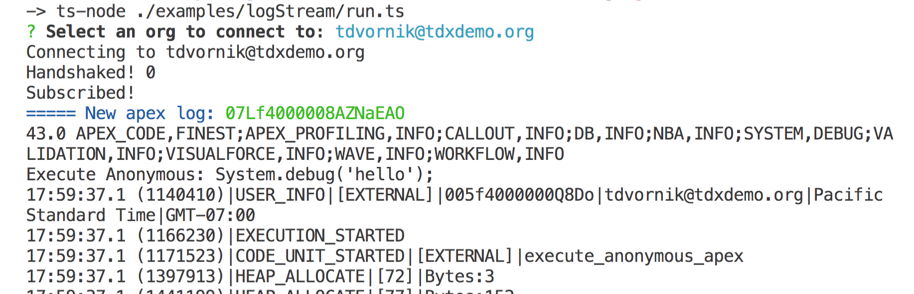

# Apex Log Streamer

Prompts the user to select a username to connect to and listen for and display apex logs. Not recommended to use with large apex logs. This should be modified to stream to files, a server, or do some custom processing.



To run from cloned repo without compiling:

```
ts-node ./examples/apexLogStream/run.ts
```
