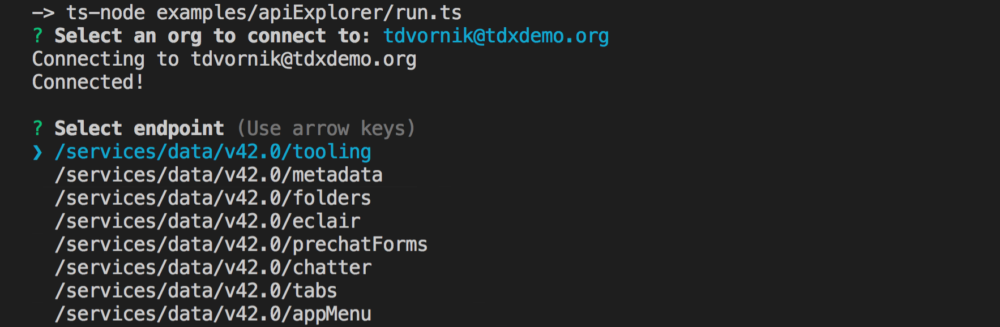

# API Explorer

Prompts the user to select a username to explore the APIs with. It will show all endpoints under the current version. When selected, it will show the output or error. If the output is a list of new endpoints, it will prompt those to the user for selection instead.

Press Ctrl+C to exit



To run from cloned repo:

```
ts-node ./examples/apiExplorer/run.ts
```
