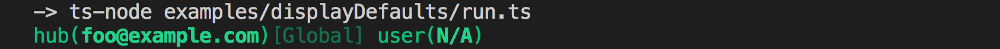

# Display Default Usernames

Displays the default dev hub username and username from their resolved config location, showing N/A if there is no default.



To run from cloned repo:

```
ts-node ./examples/displayDefaults/run.ts
```
